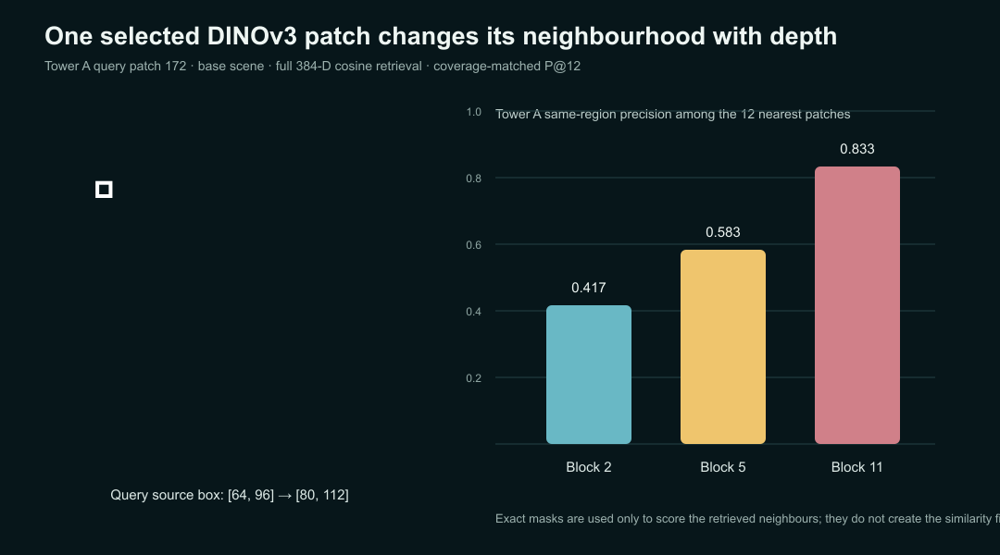
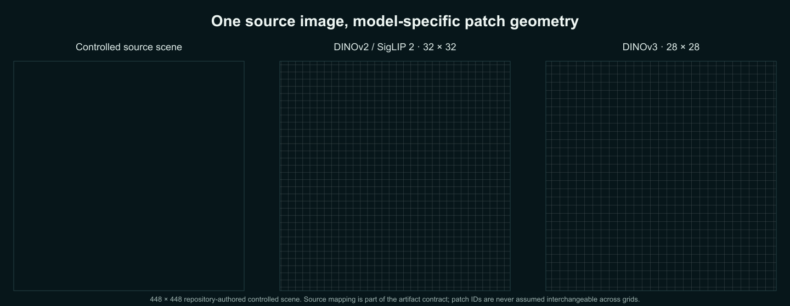
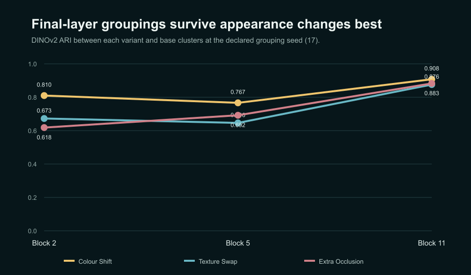
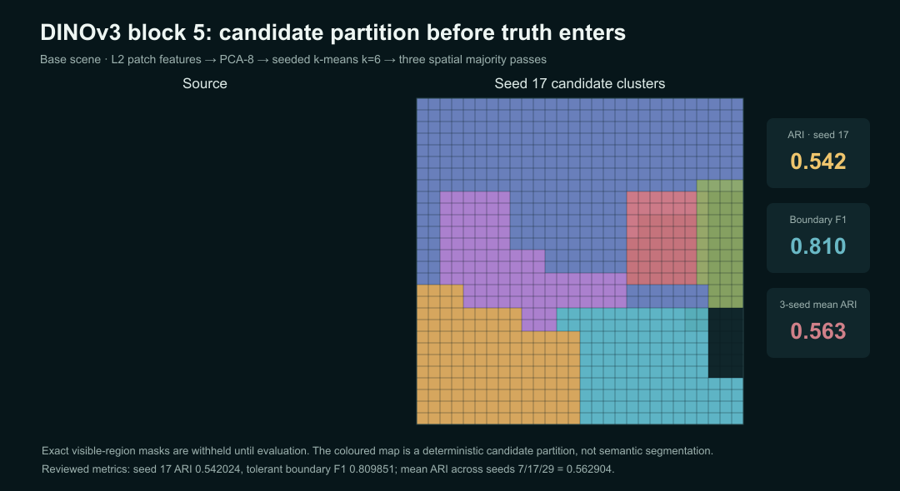
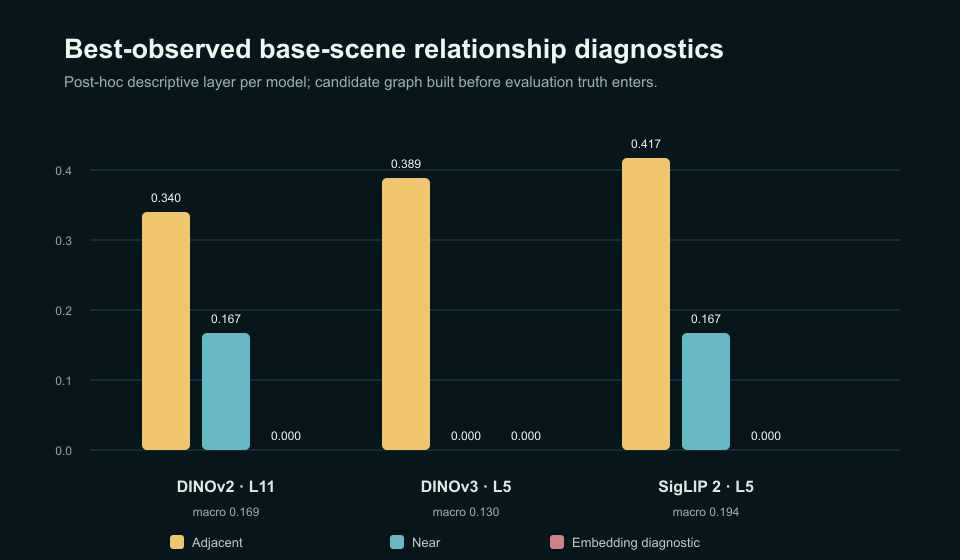
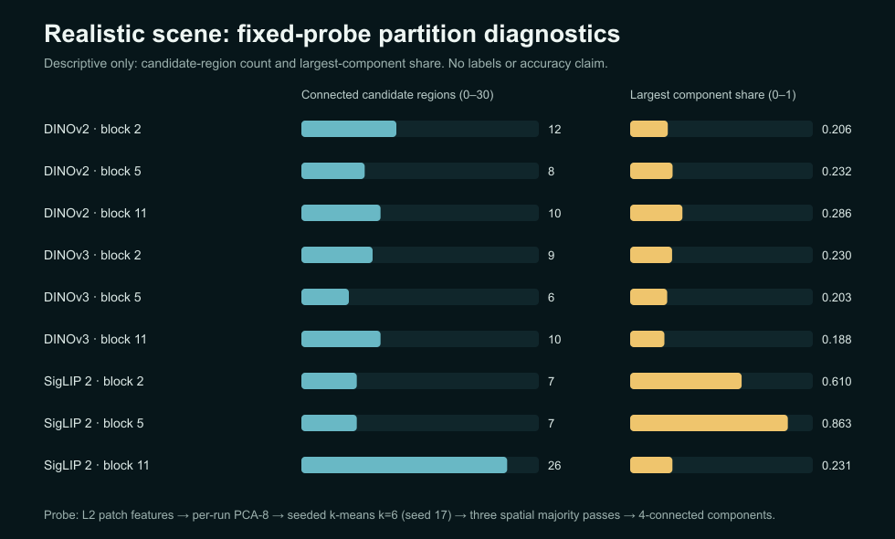

# From Pixels to Relationships

## Frozen Vision Transformer features can organize a scene—but similarity is not a relationship

## Artifacts

- [GitHub repository](https://github.com/vlada22/grounded-relational-intelligence-public)
- [Transformer Spatial Explorer](https://vlada22.github.io/grounded-relational-intelligence-public/)

The first two experiments in this series taught me to be suspicious of attractive model outputs that quietly carry stronger claims than the system can defend.

In the first experiment, that meant turning video into traceable object and event evidence before asking a language model to answer measurable questions. In the second, it meant separating a plausible depth reconstruction from a spatial state that could actually support measurements.

Article 3 moves one level earlier, into the visual representation itself.

A detector can give us nouns. A depth model can give us visible geometry. A Vision Transformer can produce a rich field of patch features. It is tempting to look at a convincing similarity map or a clean cluster projection and conclude that the model already understands which regions belong together and how they relate.

That is exactly the leap I wanted to test.

> Can frozen Vision Transformer features be turned into an inspectable spatial representation before we train an explicit segmentation or scene-graph model?

The main result is worth stating before the methodology:

> **Frozen transformer features do contain useful spatial organization. But no single layer wins every spatial probe, and useful similarity does not automatically compose into a reliable semantic relationship graph.**

*Figure 1. The same source query through DINOv3 blocks 2, 5, and 11. Same-region retrieval improves strongly with depth for this patch, while the strongest global grouping metric occurs earlier. The useful layer depends on the property being measured.*

The figure above captures the first half of the result. The same source patch can have a substantially different neighbourhood depending on where the representation is read. In this DINOv3 example, Tower A same-region P@12 rises from `0.416667` at block 2 to `0.583333` at block 5 and `0.833333` at block 11, even though the strongest global clustering alignment occurs at block 5.

The second half appears when those features are pushed further into candidate regions and graph edges. The regions can look plausible, yet the resulting relationship graph remains weak. At the fixed region-cosine rule used in the experiment, the best-observed base-scene run for every backbone scores `0.000000` F1 on the embedding-similarity diagnostic, while diagnostic macro F1 remains below `0.20` for all three models.

That negative result is not a failure of the article. It is the reason for it.

The operating rule remains the same as in the first two projects:

> Let learned models represent. Let deterministic probes compare. Let labels evaluate the result—not create it.

The complete public evidence can be inspected in the [Transformer Spatial Explorer](https://vlada22.github.io/grounded-relational-intelligence-public/). The browser runs no foundation-model inference; it loads reviewed aggregate artifacts distilled from the research pipeline.

## From pixels to patch neighbourhoods

I compared three frozen transformer families:

- **DINOv2 ViT-S/14**, the ungated reproducibility anchor;
- **DINOv3 ViT-S/16**, loaded from an immutable accepted-license snapshot during the research run;
- **SigLIP 2 Base Patch/16 NaFlex**, the vision-language contrast.

This is not a leaderboard. The models differ in patch geometry, feature width, pretraining data, and objective. The useful comparison is whether the **same spatial probes** behave similarly when the representation changes.

The public repository contains aggregate evidence and publication artifacts, not model weights or the private feature-bearing research bundles. Exact model identifiers, revisions, grids, and license boundaries are still recorded so the measurements retain their provenance.

A Vision Transformer sees a token sequence, not the image grid we see. DINOv2 and SigLIP 2 use a 32 × 32 grid in this experiment. DINOv3 uses 28 × 28. A similarity value becomes spatial evidence only after its token is mapped back to the correct source pixels.

*Figure 2. The same 448 × 448 source scene under the patch grids used by DINOv2/SigLIP 2 and DINOv3. Source-coordinate mapping is part of the evidence contract, not a display convenience.*

The Explorer preserves source-image position when switching between the two grid geometries instead of preserving a numeric patch ID. That sounds like a small implementation detail, but without it the selected point silently moves when the model changes.

## A controlled scene before a realistic one

I started with a deliberately simple procedural scene containing repeated towers, a warehouse with similar texture, vegetation, road and ground regions, a partially occluded car, and a foreground barrier.

The repeated structures are important. Two towers share procedural structure while differing in appearance. The warehouse deliberately shares texture with one tower while having different geometry. That gives the experiment a way to separate appearance similarity from structural identity instead of assuming they are the same thing.

Four locked variants cover colour, texture, and occlusion changes while retaining exact per-variant evaluation truth. Each model is inspected at blocks 2, 5, and 11. That produces 36 controlled model × variant × layer cells.

The exact masks and declared relationships are withheld while the representation is constructed. They appear only during evaluation.

The first probe is intentionally simple: select a patch, L2-normalize the feature field, compute cosine similarity to every valid patch, and project those values back into source coordinates.

That is a feature-space neighbourhood. It is not segmentation and it is not object identity.

For the reported quantitative retrieval scores, five truth regions were predeclared—Tower A, Tower B, warehouse, sky, and car—and the evaluation selects the highest-purity patch for each region. P@k should therefore be read as performance on those clean reference queries, not as average retrieval performance over every patch in the image.

## No single layer wins every probe

The three backbones disagree about where their strongest spatial behaviour lives in this experiment.

| Model | Best base retrieval | Best base clustering ARI | Best base boundary F1 |
| --- | --- | --- | --- |
| DINOv2 | block 5 · `0.8375` P@16 | block 2 · `0.532343` | block 2 · `0.831836` |
| DINOv3 | block 11 · `0.866667` P@12 | block 5 · `0.562904` | block 2 · `0.853504` |
| SigLIP 2 | block 2 · `0.8125` P@16 | block 2 · `0.669834` | block 2 · `0.929080` |

The useful result is the disagreement.

A blanket “take the final layer” rule would miss the strongest grouping depth for DINOv3 and SigLIP 2 in this protocol. A blanket “early layers are more spatial” rule would miss DINOv3’s strongest same-region retrieval at block 11.

Stability chooses a different depth again. At the predeclared grouping seed `17`, mean grouping stability across the three perturbations is strongest at DINOv2 block 11 (`0.888689`), DINOv3 block 2 (`0.875950`), and SigLIP 2 block 2 (`0.785439`).

*Figure 3. Grouping stability can prefer a different depth from retrieval or boundary alignment. One robustness number would hide that trade-off.*

The practical lesson is simple: **“the best layer” is not a property of the backbone alone. It depends on what the downstream system needs from the representation.**

## Candidate regions are probes, not segments

The next stage deliberately adds assumptions.

Patch features are L2-normalized, projected through per-run PCA-8, clustered with seeded k-means (`k=6`, seed `17`), smoothed with three spatial majority passes, and split into four-connected components.

Those components are **candidate regions**. The labels still have not influenced their construction.

Only afterward are the exact masks reduced to patch-level evaluation truth for ARI, NMI, tolerant boundary metrics, and related diagnostics.

For DINOv3 block 5, the seed-17 partition reaches ARI `0.542024` and tolerant boundary F1 `0.809851`; the three-seed mean ARI is `0.562904`.

*Figure 4. Candidate regions are built without labels. Exact controlled-scene masks enter only afterward and are projected to the patch grid for alignment metrics.*

The fixed `k=6` probe is a declared publication constraint, not an optimized clustering choice. The original research plan proposed a small `k` sweep; the final experiment instead kept one `k` fixed across all backbones. These results characterize that fixed probe and do not claim that `k=6` is optimal.

## The graph is where the easy story breaks

Once candidate regions exist, the tempting next step is to connect them with one generic “related” score.

I avoided that on purpose.

The executable graph keeps three rules separate:

- `adjacent` from geometric contact;
- `near` from source-space distance;
- `embedding_similar` from aggregate region-feature cosine.

Containment is reported as unsupported by the current flat candidate-region representation rather than assigned a convenient fabricated score.

The evaluation also keeps an important distinction explicit: `embedding_similar` is the **predicted cosine rule**, not a semantic ground-truth relation in the scene. For this diagnostic, its positive target set combines the controlled scene’s one declared `same_structure` pair and one declared `texture_similar` pair. The purpose is to ask whether one fixed cosine rule recovers either deliberately confusable pair—not to redefine structural identity and texture similarity as the same semantic relationship.

For compact comparison, each row below reports the **base-scene layer with the highest observed unweighted mean F1** across adjacency, proximity, and that embedding-similarity diagnostic. This is a post-hoc descriptive summary, not held-out layer selection.

| Model | Best observed base layer | Node recall | Adjacent F1 | Near F1 | Embedding-similarity diagnostic F1 | Diagnostic macro F1 |
| --- | ---: | ---: | ---: | ---: | ---: | ---: |
| DINOv2 | 11 | `0.800000` | `0.340426` | `0.166667` | `0.000000` | `0.169031` |
| DINOv3 | 5 | `0.600000` | `0.388889` | `0.000000` | `0.000000` | `0.129630` |
| SigLIP 2 | 5 | `0.700000` | `0.416667` | `0.166667` | `0.000000` | `0.194445` |

At the fixed region-cosine threshold of `0.88`, none of those best-observed runs recovers either diagnostic target pair.

*Figure 5. The candidate graph keeps adjacency, proximity, and embedding cosine separate. The fixed embedding-cosine diagnostic fails on the best-observed base run for every backbone.*

The failure is compositional. Candidate regions can merge or disappear before an edge rule runs. Coarse components can create geometric contacts absent from the exact masks. High aggregate cosine can capture appearance without recovering structural identity.

This is the central boundary of Article 3:

> **Similarity is evidence. A relationship is a stronger claim.**

A rich representation can make downstream reasoning possible without making that reasoning automatic.

Explicit region proposals, relation-specific calibration, hierarchy, and task supervision are natural next directions once the system moves from local feature structure to semantic claims. This experiment does not establish which of those interventions is necessary or sufficient.

## A realistic scene adds pressure, not new rules

After freezing the controlled experiment, I added one disclosed AI-generated industrial-yard scene with repeated utility cabinets, corrugated metal, a maintenance cart partly hidden by fencing and vegetation, wet reflections, shadows, pipes, pallets, weeds, and clutter.

There are no masks or semantic labels, so there is no accuracy score. The scene is a qualitative stress test, not a second benchmark.

The same three models and three depths produced nine reviewed observations. Applying the same fixed candidate-region probe gave:

- DINOv2: `12 → 8 → 10` connected regions across blocks 2/5/11;
- DINOv3: `9 → 6 → 10`;
- SigLIP 2: `7 → 7 → 26`.

The SigLIP 2 shift is especially visible under this probe. At block 5, one connected component covers `0.863` of patches; at block 11 the partition fragments and the largest component falls to `0.231`.

*Figure 6. Descriptive partition behaviour on the unlabeled realistic scene. These values describe the fixed probe; they are not semantic accuracy metrics.*

The realistic scene does not tell us which model is “right.” It shows that the same fixed probe remains strongly depth-sensitive when appearance becomes much messier. Because this scene has no labels, that is a descriptive transfer of the observed behaviour—not evidence that semantic accuracy transfers.

## Making the representation inspectable

The [Transformer Spatial Explorer](https://vlada22.github.io/grounded-relational-intelligence-public/) follows the same deployment pattern as the first two projects: inference is offline, while inspection is lightweight and public.

A reader can switch among DINOv2, DINOv3, and SigLIP 2; choose blocks 2, 5, or 11; compare retrieval, clustering, boundary, and stability metrics; inspect the best-observed relationship diagnostic; and click the controlled scene while preserving the correct model-specific patch geometry.

The public explorer is intentionally distilled. It does not distribute raw feature tensors, gated weights, or the private runtime bundles. Its job is to make the reviewed conclusions inspectable without carrying the full research environment into the release repository.

## What this experiment shows—and what it does not

The opening conclusion survives the complete experiment.

Across the 36 controlled model × variant × layer cells, their relationship evaluations, and nine qualitative realistic-scene observations:

1. **Frozen transformer features contain useful spatial organization in this controlled protocol.**
2. **No single depth dominates these probes.** Retrieval, grouping, boundaries, and stability prefer different layers and different backbones.
3. **Continuous similarity and discrete grouping are different properties.**
4. **A fixed similarity rule does not automatically compose into reliable semantic relationships.**
5. **The same fixed region probe remains strongly depth-sensitive in messier imagery.**

The experiment does **not** establish semantic segmentation, object identity, causal explanation, persistent scene understanding, or a world model. It evaluates three frozen backbones, one controlled scene family, five clean retrieval reference queries, one fixed candidate-region probe, one fixed relationship policy, and one unlabeled qualitative scene.

Those limits are not footnotes. They define exactly what the evidence can support.

## The larger idea

Foundation models are increasingly good at producing useful representations. That makes the layer above them more—not less—important.

Applications still have to decide what a feature means, how it maps back to the source, which transformations were added after the model, and which claims remain unsupported.

Article 1 separated perception from measurement. Article 2 separated plausible geometry from measurable geometry. Article 3 adds the same boundary one level earlier:

> **Similarity is evidence. A relationship is a claim. Keep the two separate until the claim can be tested.**

Everything in Article 3 still exists inside one observation. The next problem is time: when the world or camera moves, does a region seen now correspond to the same persistent thing seen later?

That is where Article 4 begins.

---

### Reproducibility note

This public repository contains the procedural controlled scene, reviewed aggregate measurements for DINOv2, DINOv3, and SigLIP 2, deterministic public validation, publication figures, and the static evidence explorer. It intentionally omits raw feature tensors, model weights, gated-model runtime material, and private research handoff bundles. The originating private research checkpoint is recorded in `PUBLICATION_SOURCE.json`.

All reviewed Article 3 source scenes are square, so the published patch-to-source mapping does not encounter letterbox ambiguity. The original research adapters record resize and padding transforms, but the generic mapping used here should not be treated as a complete arbitrary-aspect-ratio inverse-mapping contract for future experiments.

### References

- Oquab et al., [DINOv2: Learning Robust Visual Features without Supervision](https://arxiv.org/abs/2304.07193), 2023.
- Siméoni et al., [DINOv3](https://arxiv.org/abs/2508.10104), 2025.
- Tschannen et al., [SigLIP 2: Multilingual Vision-Language Encoders with Improved Semantic Understanding, Localization, and Dense Features](https://arxiv.org/abs/2502.14786), 2025.
