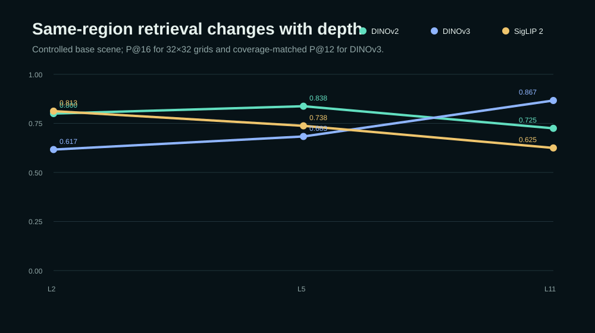
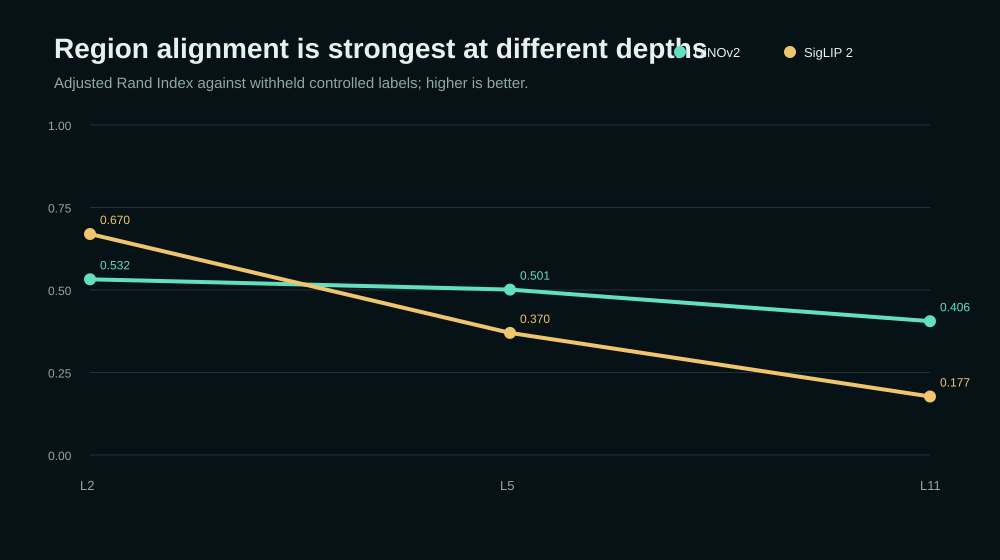
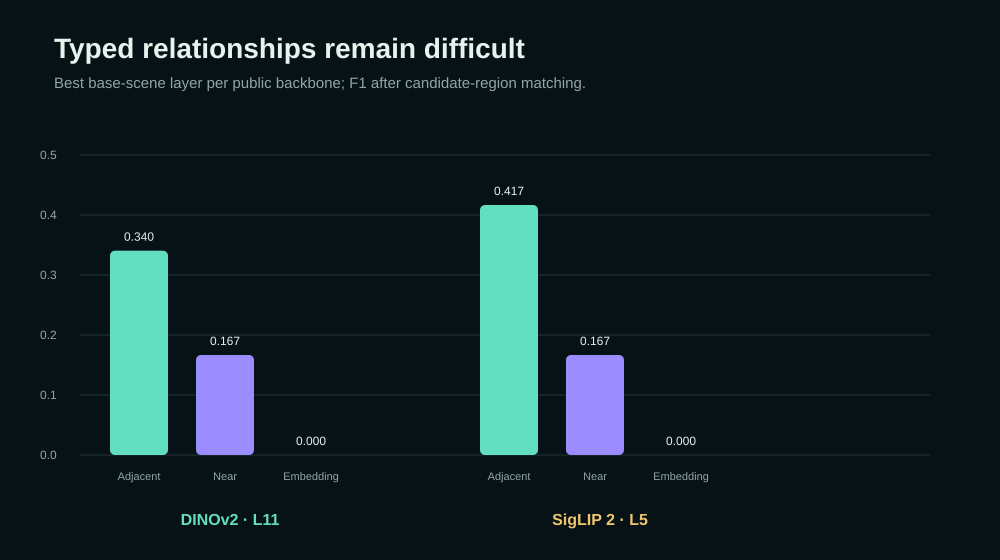
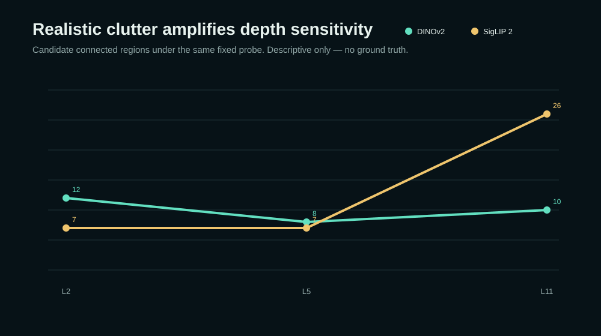

# From Pixels to Relationships

## What I learned trying to turn transformer features into a spatial graph

## Artifacts

- [GitHub repository](https://github.com/vlada22/grounded-relational-intelligence-public)
- [Interactive evidence explorer](https://vlada22.github.io/grounded-relational-intelligence-public/)

The first two experiments in this series left me with a habit: whenever a visual system gives me something that *looks* meaningful, I try to separate what the model actually produced from what I am tempted to read into it.

In the first article, that meant separating fluent video descriptions from measurable evidence. In the second, it meant separating a plausible depth map from geometry I would actually trust for distance and size.

For this third experiment, the tempting shortcut was feature space.

Modern vision transformers produce dense patch embeddings that are genuinely useful. Click one patch and nearby points in feature space often light up in sensible places. Repeated textures gather together. Object interiors can look coherent. Some layers preserve crisp boundaries; others become more invariant.

It is very easy to look at that and think: *the model already understands how the scene is organized.*

I wanted to find out how far that statement really goes.

> If a frozen vision transformer gives us useful patch features, how far can we move from **pixels**, to **regions**, to an explicit **relationship graph** before the application has to add new structure of its own?

That question became **Grounded Relational Intelligence**.

The result I keep coming back to is simple:

> **Patch features can organize a scene surprisingly well. But useful similarity is not the same thing as a reliable relationship.**

That gap between *evidence* and *claim* ended up being much more interesting than any single score.


*Figure 1. A deliberately simple procedural scene with repeated structures, a texture trap, occlusion, containment, adjacency, and nearby objects. Ground-truth labels are used only for evaluation.*

## I started with a scene designed to be annoying

Real images are wonderful for demos and terrible for catching your own assumptions.

If I show a transformer a street scene and the feature map looks coherent, I can usually tell myself a convincing story about why. But without exact scene truth, it is hard to know whether a cluster boundary is genuinely useful, whether two similar regions should be related, or whether the model is simply responding to colour and texture.

So I built a 448 × 448 procedural scene with several deliberate traps.

There are two tower-like structures that should make instance similarity tempting. A warehouse shares a repeated stripe pattern with one tower, giving the representation an easy texture shortcut. A car is partially hidden by a foreground barrier. Some regions touch, some are merely close, and a warehouse door is geometrically contained by the larger building.

The scene is intentionally a little artificial. That is the point. Every important region and relationship is known exactly, so the experiment can be wrong in ways I can actually measure.

The labels stay out of feature extraction, PCA, clustering, and candidate graph construction. They appear only afterward, when the candidates are evaluated.

That one rule matters a lot. Otherwise it would be too easy to bake the answer into the pipeline and then congratulate the pipeline for discovering it.

## Two backbones, one deliberately boring probe

I used two frozen vision backbones:

- **DINOv2 ViT-S/14**
- **SigLIP 2 base patch16 NaFlex**

Neither model is fine-tuned for this experiment. I wanted the downstream logic to stay almost boring so that changes in the result could be traced back to changes in the representation.

For each model I inspected blocks 2, 5, and 11, then applied the same candidate-region probe:

```text
frozen patch features
  -> L2 normalization
  -> per-image PCA to 8 dimensions
  -> seeded k-means, k = 6
  -> three spatial majority passes
  -> connected components
```

This is not meant to be a competitive segmentation method. It is a fixed measuring instrument.

I then asked four separate questions:

1. **Retrieval:** if I choose a clean patch inside a region, do its nearest neighbors come from the same region?
2. **Clustering:** does the feature partition line up with the exact scene regions?
3. **Boundary quality:** do candidate boundaries fall near the known region boundaries?
4. **Grouping stability:** when the scene appearance changes, does the discrete partition remain similar?

At first glance those sound like different ways of asking the same thing.

They are not.

That became the first useful result.

## There is no layer called “spatial intelligence”

I expected depth to matter. What surprised me was how differently it mattered depending on what I measured.

For DINOv2, same-region retrieval is strongest at block 5:

- block 2: `0.8000`
- block 5: **`0.8375`**
- block 11: `0.7250`

But clustering alignment is strongest earlier:

- block 2 ARI: **`0.5323`**
- block 5 ARI: `0.5011`
- block 11 ARI: `0.4055`

Boundary quality follows the same early-layer pattern. Grouping stability goes the other way and is strongest at block 11: **`0.8887`**.



*Figure 2. Retrieval changes with depth, but the direction depends on the backbone. Deeper does not automatically mean more spatially useful.*

SigLIP 2 tells a different story. On the same base scene, its earliest probed block is strongest on every direct spatial-alignment measure I tracked:

| Metric | Block 2 | Block 5 | Block 11 |
| --- | ---: | ---: | ---: |
| Same-region retrieval | **0.8125** | 0.7375 | 0.6250 |
| ARI | **0.6698** | 0.3701 | 0.1771 |
| Boundary F1 | **0.9291** | 0.7402 | 0.6074 |
| Grouping stability | **0.7854** | 0.6286 | 0.4882 |

That does not make the later features “bad.” They are being transformed toward the objectives the model was trained to solve. The practical lesson is narrower and more useful:

**The representation depth that is useful for one spatial question may be the wrong depth for another.**



*Figure 3. The same fixed clustering probe exposes very different depth profiles across the two backbones. These are controlled-probe measurements, not a model leaderboard.*

This sounds obvious after the fact, but I think it is easy to forget in system design. We often talk about “using DINO features” or “using SigLIP features” as though a transformer exposes one representation.

It exposes a sequence of representations.

If the next stage cares about boundaries, retrieval, grouping stability, or relationships, the real design question is not just *which model?* It is *which layer, for which claim?*

## The two towers were the most revealing failure

I put two tower-like structures in the scene because I wanted to tempt the representation into something stronger than local similarity.

If feature similarity were already close to object identity, a query on Tower A should consistently pull Tower B into the same semantic neighborhood.

That is not what happened.

Some layers were very good at retrieving patches from the same tower while still doing a poor job of connecting the two separate towers as corresponding instances.

The representation could answer something like:

> “Which patches look like this patch in this context?”

without answering:

> “Which other object is another instance of the same thing?”

That distinction became one of the clearest lessons in the project.

Similarity is continuous evidence. Identity is a semantic claim.

The first can support the second. It cannot quietly replace it.

## Then I tried to make the graph explicit

A region map was never the final goal. I wanted to know what happened when the system had to state actual relationships between candidate regions.

So after candidate regions were built, I added separate deterministic rules for three edge types:

- `adjacent` — components touch on the patch grid
- `near` — components are within a fixed source-image distance without touching
- `embedding_similar` — mean region features exceed a fixed cosine threshold

Only after those edges existed did the exact scene masks enter for node matching and scoring.

This is where the neat story fell apart, in a useful way.

The best selected runs were weak:

| Model | Selected layer | Node recall | Adjacent F1 | Near F1 | Embedding-similar F1 | Macro F1 |
| --- | ---: | ---: | ---: | ---: | ---: | ---: |
| DINOv2 | 11 | 0.80 | 0.340 | 0.167 | **0.000** | 0.169 |
| SigLIP 2 | 5 | 0.70 | 0.417 | 0.167 | **0.000** | 0.194 |



*Figure 4. Recovering useful regions and recovering useful relationships are separate problems. The fixed embedding-similarity rule recovers none of the declared semantic-similarity edges in the selected runs.*

I actually like this failure because it makes a common shortcut harder to justify.

It would be easy to collapse adjacency, distance, and embedding similarity into one generic `related` score. The graph would look cleaner. It would also become much harder to say what any edge means.

If adjacency works differently from proximity, and embedding similarity can fail entirely at a fixed threshold, then those relationships should remain separate enough to fail independently.

A graph with awkward, inspectable failures is more useful to me than a polished graph with ambiguous semantics.

## One relationship was missing before scoring even began

The warehouse door exposed a different problem.

It is geometrically contained by the warehouse, but the flat candidate partition cannot represent containment at all. Every patch belongs to one disjoint component. A component can sit next to another component; it cannot also live *inside* a parent component as part of a hierarchy.

So there is no meaningful containment F1 to report.

The representation simply does not have the right shape for that claim.

This is a small result, but I think it is an important engineering habit: **a threshold cannot repair a missing data structure.**

If the application needs containment, parts, or nested regions, the representation has to become hierarchical or overlapping before the relationship can be measured honestly.

## A realistic scene made the depth effect harder to ignore

The controlled scene tells me when the pipeline is wrong, but it does not look much like the visual mess of a real environment.

So I ran the same fixed probe on a more realistic industrial-yard scene with repeated cabinets, corrugated surfaces, fencing, vegetation, reflections, shadows, depth variation, and partial occlusion.

There is no exact scene truth here, so I do not turn it into an accuracy test. I only look at how the candidate partition changes.

For DINOv2, the connected candidate-region count moves **12 → 8 → 10** across blocks 2, 5, and 11.

For SigLIP 2, it moves **7 → 7 → 26**.



*Figure 5. The same fixed probe changes character with representation depth on a cluttered scene. The counts are descriptive rather than accuracy measurements.*

The exact counts are not the point. What matters is that the downstream system receives a noticeably different kind of partition depending on where the features come from.

That matters if the next stage expects stable objects, persistent regions, or graph nodes with reasonably consistent meaning. The code after the transformer can be completely deterministic and still inherit instability from the representation it receives.

## I built the explorer because tables hide the feel of the trade-off

The [interactive evidence explorer](https://vlada22.github.io/grounded-relational-intelligence-public/) puts the controlled measurements next to the source scene.

You can switch between DINOv2 and SigLIP 2, move across blocks 2, 5, and 11, compare retrieval, clustering, boundary quality, and grouping stability, and inspect the selected typed-relationship result.

You can also click the controlled image and see the exact 32 × 32 source patch coordinates.

That source mapping is intentionally simple, but I think it is important. Feature-space analysis becomes easier to reason about when every selected patch still has an unambiguous path back to pixels.

The explorer is not meant to make the result look more sophisticated. It is there to make the trade-offs easier to inspect.

## What I think this experiment actually shows

The strongest result is not that one transformer or one layer won.

It is that the path from features to relationships contains several different problems that are easy to collapse into one:

1. a patch representation can be locally useful without being instance-aware
2. a clustering probe can recover some regions and miss others
3. region errors become node errors before relationship scoring even begins
4. different relationship types need different evidence and different rules
5. some relationships require a richer representation than a flat partition can express

Feature depth is part of that design, not a harmless implementation detail.

The limits are just as important. This is a small controlled experiment, not a segmentation benchmark or a general scene-graph benchmark. The realistic scene is qualitative. The graph rules are intentionally simple. I did not train a proposal network, tune thresholds over a large held-out dataset, or test thousands of scenes.

Those would be sensible next steps if the goal were state-of-the-art relationship detection.

My goal here was different: I wanted to find the boundary between what a frozen representation gives us and what the application still has to construct explicitly.

## The larger pattern across the series

After three experiments, I see the same pattern showing up at different levels.

In video, a perception model can observe an object, but a deterministic tool should still own a measurable event such as a boundary crossing.

In 3D reconstruction, a depth model can estimate geometry, but camera conventions, scale, visibility, and measurement logic still decide which distances deserve to be trusted.

Here, a transformer can organize patches, but the application still has to decide what becomes a region, what kind of relationship an edge represents, and what evidence is strong enough to justify that edge.

That leads to the principle I am taking into the next article:

> **Similarity is evidence. A relationship is a claim. Keep the two separate until the claim can be tested.**

The distinction is conservative on purpose. It makes the system easier to debug, easier to explain, and less likely to turn an attractive visualization into an unsupported conclusion.

The next step is temporal. Once regions and relationships change from frame to frame, the question becomes: did a relationship persist, disappear, become occluded, or was it never observable in the first place?

That is where a static scene graph starts turning into memory.

I have published the code, aggregate evidence, figures, and [interactive explorer](https://vlada22.github.io/grounded-relational-intelligence-public/) in the [Grounded Relational Intelligence repository](https://github.com/vlada22/grounded-relational-intelligence-public).

Where would you draw the line between a useful visual similarity and a relationship you would trust a system to state as fact?

---

### Reproducibility note

The repository contains the procedural controlled scene, reviewed aggregate measurements for DINOv2 and SigLIP 2, deterministic scripts that regenerate the publication figures, the static evidence explorer, and validation tests for the published artifact structure. The figures are rebuilt directly from `demo/data/results.json`.

### References

- Oquab et al., [DINOv2: Learning Robust Visual Features without Supervision](https://arxiv.org/abs/2304.07193), 2023.
- Tschannen et al., [SigLIP 2: Multilingual Vision-Language Encoders with Improved Semantic Understanding, Localization, and Dense Features](https://arxiv.org/abs/2502.14786), 2025.
